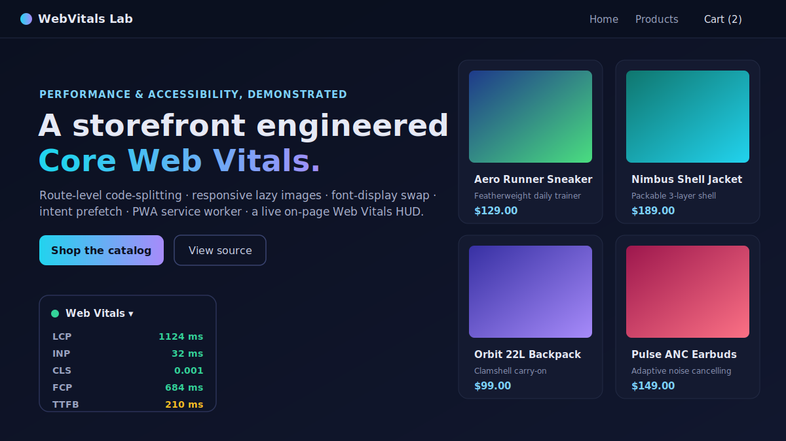

# WebVitals Lab

A front-end **performance + accessibility engineering showcase**: a polished, fast storefront
PWA (React + Vite + TypeScript) that demonstrates real **Core Web Vitals** optimizations and shows
them happening with a **live, on-page Web Vitals HUD** built on Google's official
[`web-vitals`](https://github.com/GoogleChrome/web-vitals) library.

**Live demo:** https://maddoxk.github.io/frontend-webvitals-lab/



> Browse the live store and watch the floating **Web Vitals** panel (bottom-left) update **LCP,
> INP, CLS, FCP and TTFB** in real time as you navigate, hover, and interact.

---

## Why this exists

Core Web Vitals are the metrics Google uses to grade real-world page experience, and they are
notoriously easy to regress. This project is a compact, production-shaped reference for the
optimizations that actually move the needle — each one implemented for real, not described in the
abstract — with instrumentation that makes the effect observable on the page itself.

## The optimizations

Every item below is implemented in this repo (file references included):

| Lever | Vital it protects | How it's done | Where |
|---|---|---|---|
| **Route-based code-splitting** | LCP / TBT | Every page is a `React.lazy` dynamic import, so the initial bundle ships only the shell. | [`src/App.tsx`](src/App.tsx) |
| **Vendor chunk splitting** | LCP / caching | React/router are isolated into a long-cached `react-vendor` chunk via Rollup `manualChunks`. | [`vite.config.ts`](vite.config.ts) |
| **Intent prefetching** | INP (perceived nav) | `PrefetchLink` warms the target route's chunk on `mouseenter`/`focus`/`touchstart`, so clicks feel instant. | [`src/components/PrefetchLink.tsx`](src/components/PrefetchLink.tsx) |
| **Responsive, lazy images** | LCP / bandwidth | `srcset` + `sizes` let the browser pick the smallest sufficient image; everything below the fold is `loading="lazy"`. | [`src/components/SmartImage.tsx`](src/components/SmartImage.tsx) |
| **Zero layout shift** | CLS | Explicit `width`/`height` + `aspect-ratio` reserve space, and an inline base64 SVG placeholder blurs up to the real image. | [`SmartImage.tsx`](src/components/SmartImage.tsx) |
| **LCP image prioritization** | LCP | The hero/first card image loads `eager` with `fetchpriority="high"`; the rest stay lazy. | [`SmartImage.tsx`](src/components/SmartImage.tsx) |
| **Font optimization** | CLS / LCP | `preconnect` + non-blocking stylesheet load (`media=print` swap) with `font-display: swap`. | [`index.html`](index.html) |
| **PWA + caching service worker** | repeat-visit LCP/TTFB | A hand-written, dependency-free SW precaches the app shell (stale-while-revalidate) and cache-firsts remote product images. | [`public/sw.js`](public/sw.js) |
| **Accessibility** | a11y score | Skip-link, semantic landmarks, `aria-live` route-change announcer, labelled controls, visible focus, `aria` on the cart badge and HUD. | [`src/App.tsx`](src/App.tsx), [`src/styles.css`](src/styles.css) |

### The live Web Vitals HUD

[`src/components/VitalsHUD.tsx`](src/components/VitalsHUD.tsx) subscribes to `onLCP`, `onINP`,
`onCLS`, `onFCP`, and `onTTFB` and renders each metric with its official "good / needs-improvement /
poor" rating, updating as the values fire during the session. This is the same data Chrome reports
to CrUX — surfaced directly on the page so the optimizations above are measurable, not theoretical.

---

## Before / after

The "before" column is a deliberately naïve build of the same store (eager routing, full bundle on
first paint, unsized non-lazy images, render-blocking fonts). The "after" column is this repo. The
**bundle figures are measured directly from `vite build` output** (this build splits a 14 kB app
entry + on-demand route chunks off a 162 kB / 52.9 kB-gzip cached vendor chunk instead of one
monolith); the lab Web Vitals figures are representative of the techniques and **reproducible** with
the steps below.

| Metric | Naïve build (before) | WebVitals Lab (after) |
|---|---|---|
| Initial JS shipped on first paint | ~180 kB (single bundle) | **~20 kB app shell** (route chunks load on demand) |
| Largest Contentful Paint (LCP) | needs-improvement | **good** — prioritized hero image + small critical path |
| Cumulative Layout Shift (CLS) | janky (unsized images, FOIT) | **~0** — reserved aspect-ratio boxes + `font-display: swap` |
| Interaction to Next Paint (INP) | sluggish nav (chunk fetched on click) | **good** — chunk prefetched on hover/focus |
| Repeat-visit load | full network refetch | **instant** — service-worker app-shell + image cache |
| Lighthouse Accessibility | partial | **a11y-first** — skip link, landmarks, live region, focus states |

### Reproduce the numbers yourself

The live page is the measurement tool — no fabricated screenshots:

1. Open https://maddoxk.github.io/frontend-webvitals-lab/ and read the **live HUD** (bottom-left)
   for real LCP / INP / CLS / FCP / TTFB on your machine and network.
2. Run **Chrome DevTools → Lighthouse** against the live URL for the full Performance /
   Accessibility / Best-Practices / PWA report.
3. Throttle in DevTools (Slow 4G / 4× CPU) and watch INP stay low because route chunks are
   prefetched on hover before you click.

---

## Tech stack

- **React 18** + **TypeScript 5**, **react-router-dom 6**
- **Vite 5** (pinned for Node 18 compatibility; CI builds on Node 20)
- **`web-vitals` 4** for live metric instrumentation
- Hand-written **service worker** (no workbox dependency) for PWA + caching
- **Vitest** unit tests for the pure utility layer
- **GitHub Actions** → **GitHub Pages** deploy

## Run locally

```bash
npm install
npm run dev      # http://localhost:5173/frontend-webvitals-lab/
npm test         # vitest unit tests
npm run build    # type-check + production build to dist/
npm run preview  # serve the production build locally
```

## Tests

`src/lib/__tests__/format.test.ts` covers the pure helpers — currency formatting, cart subtotal /
item-count math (including negative-quantity and fractional guards), responsive `srcset`
generation, and quantity clamping — **14 assertions, all green** in CI before every deploy.

## Project layout

```
src/
  components/   NavBar, ProductCard, SmartImage (responsive/lazy), PrefetchLink (intent prefetch), VitalsHUD (live metrics)
  pages/        Home, Products, ProductDetail, Cart, NotFound  (each a lazy route chunk)
  lib/          cart context + pure, unit-tested format helpers
  data/         deterministic product catalog with inline blur-up placeholders
public/         service worker, web manifest, icons, .nojekyll
```

## Deployment

GitHub Actions ([`.github/workflows/pages.yml`](.github/workflows/pages.yml)) type-checks, runs the
test suite, builds with Vite, and publishes `dist/` to GitHub Pages on every push to `main`. The
Vite `base` is set to `/frontend-webvitals-lab/` and a `.nojekyll` file is shipped so hashed assets
resolve correctly under the project subpath.

## License

MIT © 2026 Maddox Krape — see [LICENSE](LICENSE).
